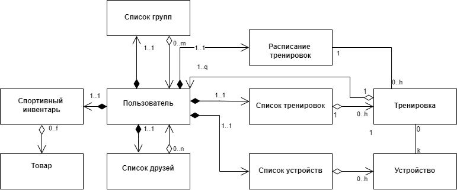

#  Разработка концептуальной архитектуры.

Рисунок 1 Высокоуровневая архитектура

Приведенную выше диаграмму можно рассматривать как высокоуровневую диаграмму классов. Аккаунт пользователя содержит списки друзей, групп в которых состоит пользователь, спортивного инвентаря, тренировок и подключаемых устройств, а также расписание тренировок. При тренировки могут быть совместными (содержат в себе ссылки на пользователей) и могут использовать устройства из списка подключаемых устройств. Сюда можно еще добавить единицу информации в группе (например пост), но это уже не имеет отношения к доменной модели.
