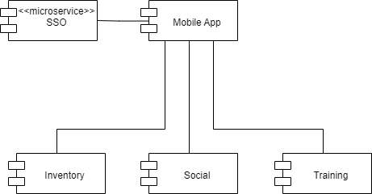

Разобьем приложение на домены. Каждому домену может соответствовать (микро)сервис:
Account – то, что связано только с пользователем – его спортивный инвентарь. так же списки групп, друзей, тренировок, датчиков.
Training – тренировки и все что с ними связано: подключаемые датчики, расписание тренировок, список участников, маршрут, таблица результатов
Interaction - социальное взаимодействие: группы, чаты, поиск пользователей, уведомления
SSO. Отдельным компонентом выделим SSO – логически он является частью Account, но технически это общий компонент для всех приложений компании и в нем хранятся персональные данные (а в других сервисах нет), соответственно к нему предъявляются другие требования по безопасности и размещению в облаке.
Mobile App – еще один технический компонент, выполняет роль frontend на стороне пользователя, так же позволяет выполнять часть действий локально (выполняет функции кеширования), что бы приложение могло работать в сетях с низким уровнем подключения или с некоторыми ограничениями автономно (например пользователь может создавать тренировки без подключения к сети).

Рисунок 1. Высокоуровневая диаграмма компонентов (разбиение по доменам)
Добавим необходимые технологические компоненты:
Message Queue – служит для гарантированной доставки сообщений, принято решение использовать очередь в связи с необходимостью работать с сетями с низким уровнем подключения.
API Gateway – служит единой точкой входа для backend приложения, выполняет функции маршрутизации и балансировки нагрузки, так же может выполнять логирование.
Discovery service – Сервис обнаружения – выполняет функции маршрутизации, сервисы регистрируются в нем и когда одному сервису нужно получить доступ ко второму он обращается через API Gateway в Discovery service получает оттуда информацию где находятся все реплики данного сервиса, выполняет балансировку в API Gateway и перенаправляет запрос к нужной реплике второго сервиса через очередь сообщений.
При этом компонент SSO можно подключать напрямую, это общий компонент для всех приложений компании, если остальные приложения не используют данную инфраструктуру, то подключать SSO через нее незачем.

Рисунок 2.  диаграмма компонентов с инфраструктурой
При дальнейшем развитии можно добавить еще несколько технологических компонент и использовать в качестве сервисной шины предприятия (Enterprise Service Bus):
“Publication Service” или “Registrar”   Регистрирует сервисы в “Discovery service”. Т. о. сервис, который нужно зарегистрировать не должен ничего знать про Service Discovery, но это дополнительный компонент, который нужно поддерживать.
“Configuration Service” – Сервис для конфигурации других приложений. Т. о. конфигурация всех сервисов хранится в одном месте и ее можно менять динамически, например для проведения A-B тестирования или канареечных релизов.
“Logging Service” – собственно отдельный сервис логирования, если встроенных функций выбранного API Gateway окажется недостаточно или их не будет.
SSO при этом так же должно работать через API Gateway, но не обязательно через очередь – потому что все сервисы будут проверять в нем токен при каждом запросе и не нужно увеличивать Latency.

Рисунок 3.  диаграмма компонентов с использованием корпоративной шины данных (Enterprise system bus, ESB)
Контекст: Приложение будет взаимодействовать со следующими компонентами:
SSO – Общий компонент для всех приложений компании, служит для бесшовного перехода между приложениями.
Store – магазин, в него можно перейти по промоакциям или по подсказкам об обновлении инвентаря.
Observability backend: любые системы мониторинга, это может быть мониторинг Zabbix, Логирование (Loki, ELK) или любое ПО с использованием стандарта OpenTelemetry.

Рисунок 4.  диаграмма контекста
Поскольку целевым является развертывание в облаке, предлагается использовать контейнеризацию Docker и оркестрацию Kubernetes как максимально переносимые компоненты: практически все облака поддерживают и многие сопровождают их, систему легко мигрировать с одного облака в другое, так же это самый распространенный стек и у него большое комьюнити, соответственно столкнувшись с проблемой в большинстве случаев можно будет найти готовый от вет.
Все сервисы разместим в k8s. Все технологические компоненты являются обыкновенными сервисами и могут быть развернуты в любых количествах. Мастер нода может быть совмещено с worker node. Ниже приведена диаграмма для боле простого случая, но при использовании ESB ничего не изменится, просто добавится несколько компонент на мастер-ноде. Все соединения из вне в k8s и из k8s кластер баз данных (DB Cluster) должны идти через Reverse Proxy – он будет выполнять функции Firewall и балансировщика нагрузки. Так же вне k8s должен находиться Observability backend. Можно использовать отдельные компоненты, например Zabbix для мониторинга и Loki для логирования, тогда в каждой ноде будет установлен агент (коллектор) соответствующего сервиса, а вен кластера сервисная часть с соответствующей БД. На схеме ниже выбран подход с использованием стандарта OpenTelemetry (OTL). В данном случает OTL collector развертывается на каждой ноде и передает данные в соответствующий backend. Так же здесь используется Grafana для визуализации логов, метрик и трассировок, сама по себе она не собирает никакой информации, а просто предоставляет удобный интерфейс. Выбор конкретных компонент указан на схеме для примера.
 
