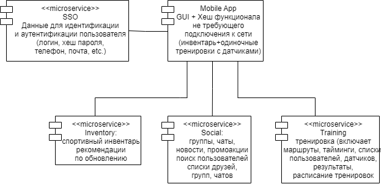
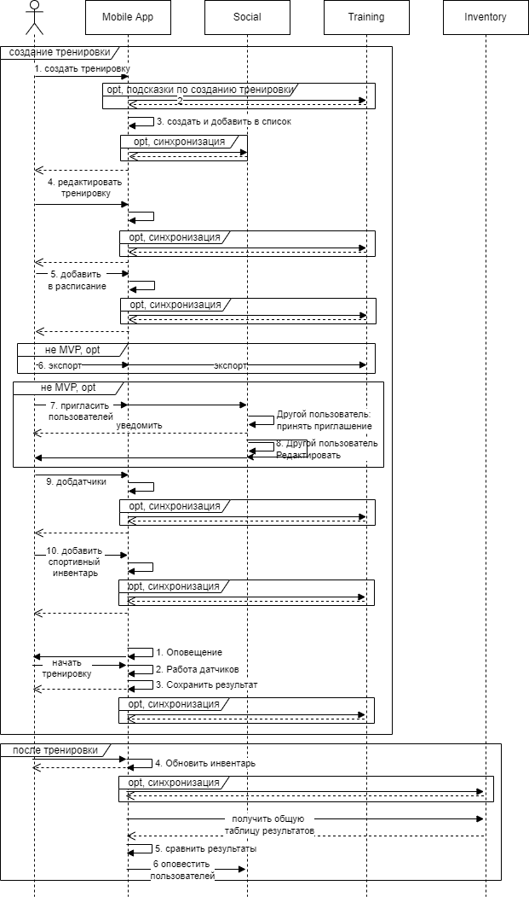
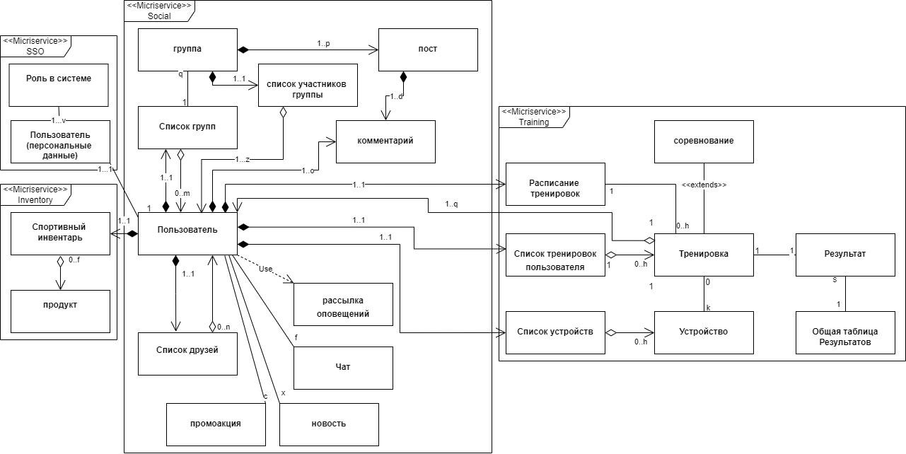
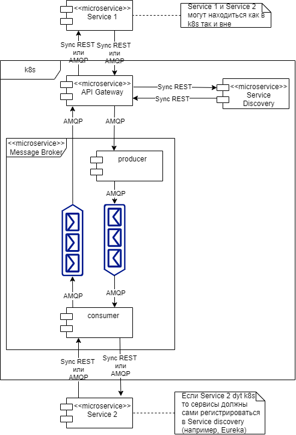
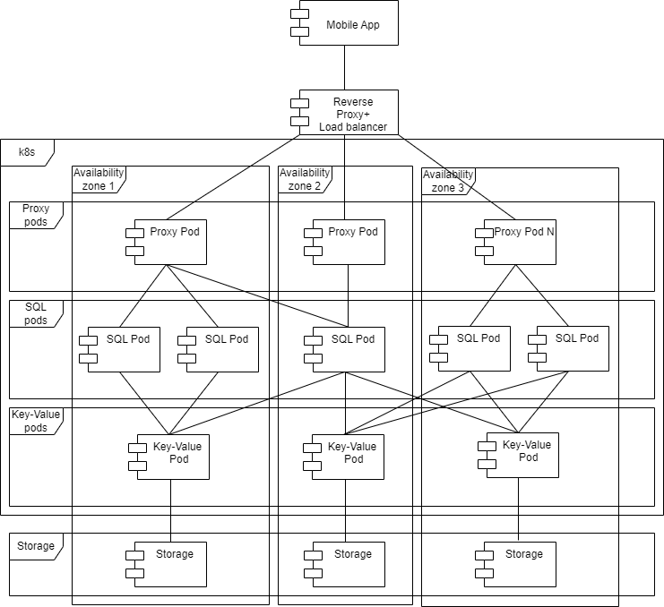
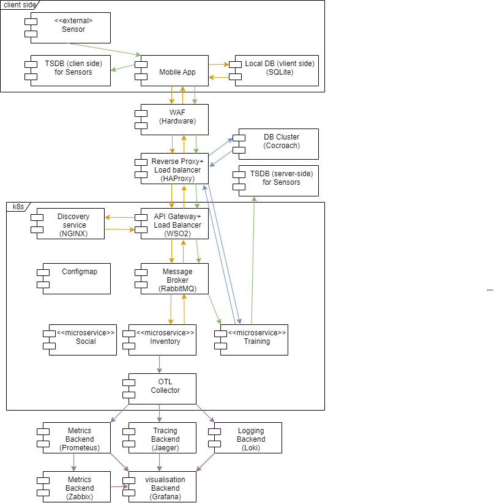
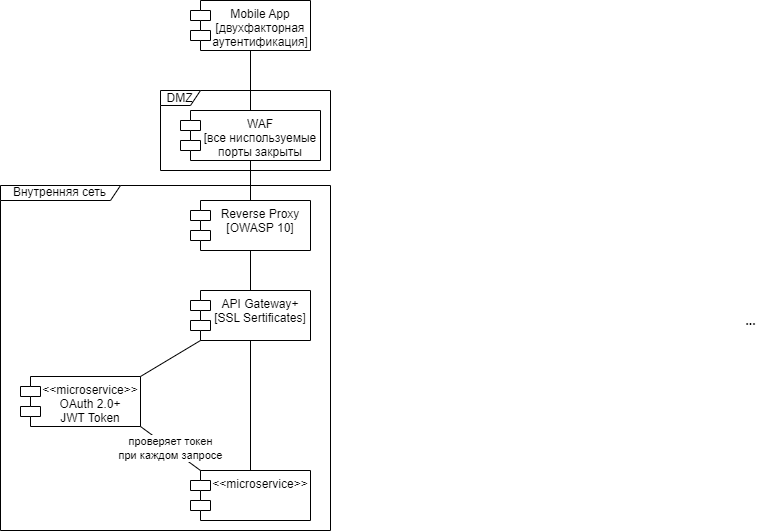
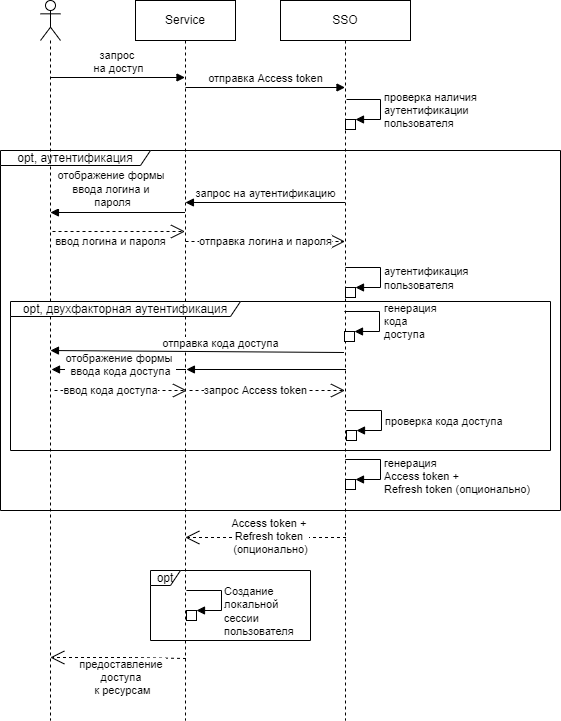

# Functional view
Разобьем функционал по доменам : функционал который может работать без подключения к сети вынесем отдельно: это инвентарь и тренировки. Этот функционал будет реализовываться боьшей частью на стороне клиента, а на стороне сервера будет синхронизация (что бы пользоваться аккаунтом с различных устройств и что бы другие сервисы могли использовать эту информацию и контент требующий подключения к интернету (например глобальные списки результатов тренировок/соревнований в тренировках) или промоакции в инвентаре) Все социальные взаимодействия требуют подключения к сети и будут вынесены в отдельный модуль. В принципе сервисы Инвентарь и Тренировки можно объединить.

Для примера приведем диаграмму последовательности для тренировок, все остальные диаграммы выглядят однотипно и намого короче, не вижу смысла приводить их

# Informational view

# Concurrency view
## Межпроцессное взаимодействие между микросервисами
ля приложения важна корректная работа в сетях с низким уровнем подключения (тренировки могут происходить в зонал с нестабильным сигналом) и возможность корректной обработки резкого всплеска пользователей (например, проведение соревнований). Так же приложение будет широко распростаранено географически - возможно потребуются региональные сервера. Все это приводит к необходимости использования брокера сообщений. Взаимодействие между сервисами будет происходить посредством асинхронного API (AMQP/JMS). При этом сами микросервисы могут предоставлять синхронные REST API. Брокер сообщений состоит изследующих частей: Producer - создает сообщения и помещает из в очередь сообщений, очереди сообщений (могут быть 1к1 или издатель-подписчики) и Consumer - опрашивает очередь и считывает предназначенные ему сообщения. Сообщение состоит из тела и заголовка. Сообщение может содержать в себе id очереди в которую нужно положить ответ. Consumer обращается к сервису 2 (по синхронному протоколу REST API/RPC или так же по AMQP/JMS. Исходный запрос на API Gateway так же может быть REST API или AMQP/JMS

## Транзакции в БД
Для хранения данных выберем “Cloud-Native” решение: будем применять подход “Distributed SQL”. Он гарантирует согласованность данных (consistency), как если бы транзакции проходили последовательно. Рассмотрим пример с использованием CockroachDB – open source Distributed SQL БД от Google. Для обеспечения согласованности данных CockroachDB требует, чтобы все операции записи распространялись на кворум данных, для этого используется протокол согласия Raft.

CocroaccDB состоит из следующих слоев:

*“SQL layer”* выставляет наружу SQL API и конвертирует SQL-запросы в низкоуровневые запросы на чтение/запись в нижележащий “слой Key-Value”. Состоит из следующих компонент: 

    “SQL API” – формирует пользовательский интерфейс, 

    “Parser” – конвертирует SQL в abstract layer tree (AST), 

    “Cost-based optimizer” – оптимизирует AST и конвертирует в логический запрос, 

    “Physical planner” – конвертирует логический запрос в физический на одной или нескольких нодах, 

    “SQL Execution Engine” – выполняет физический запрос – чтение/запись в следующий “Слой Key-Value”.

*“Transaction layer”* реализует поддержку ACID транзакций, путем координации конкурентных операций. Используется протокол коммитов “Parallel Commits”.

*“Distribution layer”* делает всю информацию в БД доступной из любой ноды .

*“Distribution layer”* – копирует информацию между нодами для поддержания согласованности. Используется протокол консенсуса Raft.

*“Storage Layer”* – записывает информацию на диск. Используется движок хранения информации “Pebble”. Информация хранится в формате “Ключ-значение”

Каждый кластер для одного региона имеет как минимум три узла, распределенных по трем зонам доступности (*“Availability Zone”*, AZ) в регионе поставщика облачных услуг. Кластеры с несколькими регионами аналогичны кластерам с одним регионом, где узлы распределены по трем или более зонам доступности в каждом регионе

Перед кластером CocroachDB ставится Load Balancer и Proxy выполняющий роль API Gateway и дополнительной балансировки.

# Infrastructural view

# Security view
Трафик извне в сеть предприятия должен попадать через WAF расположенный в DMZ-зоне, на нем должны бать закрыты все порты кроме используемых
Далее весь трафик проходит через Reverse Proxy который анализирует его и отбрасывает потенциально опасный, большинство Reverse Proxy обеспечивают защиту от угоз OWASP Top10.
Взаимодействие между компонентами должно происходить по шифроманным протоколам TLS/SSL с использованием SSL сертификатов. Для авторизации и аутентификации пользователей используется SSO, работающий по протоколу OAuth 2.0. Сначала сисема (микросервис) регистрируется в SSO. Затем эта система может выдавать токены авторизованным пользователям. При любом обращении в одну из систем использующих SSO она п роверяет валидность токена в SSO. Должна быть предусмотрена двухфакторная аутентификация 

Ниже приведена диаграмма последовательности как пользователь получает доступ к ресурсу (при запросе к сервису проверяется токен и если его нет то пользователю выводится окно авторизации. Использкуется 2 токена: токен доступа и refresh токен (валиден дольше чем токен доступа). Если у пользователя валиден refresh токен, но закончился токен доступа, то он может получить новый в SSO без повторного логина.)

